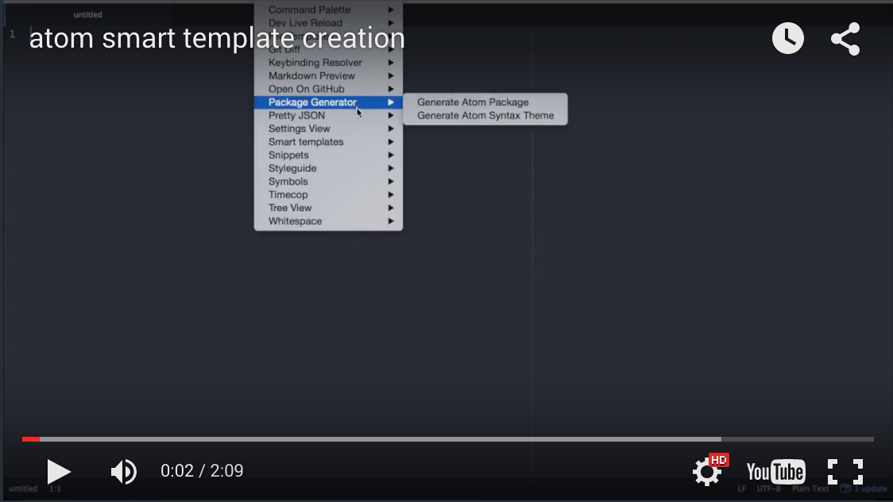

# atom-smart-template package

The package is designed for quick and easy creation of file or multiple files and directories from a template using parameters.

## How to use
Use the command "Create files from template" from the context menu of the file tree.

<a href="http://www.youtube.com/watch?v=jfm30wRNL1o">

</a>

## How to create new template

<a href="http://www.youtube.com/watch?v=mCuzvBaPWEo">

</a>

The main file of template is "index.js":

```js
module.exports = {

    name: "Base template",

    params: ["Name", "Body"],

    rules: function(config) {

      return({
        items: [
          { destinationFile: "index.html",           sourceTemplateFile: "index.template"    },
          { destinationFile: "images/someimage.jpg", sourceContentFile: "img/someimage.jpg" }
        ]
      });

    }

}
```

The ```rules``` function has a ```config``` parameter  which contains the parameter values entered by the user when creating the template. You can use these values to generate the names and content of destination files. Also you can simply copy the files from your template (```sourceContentFile```) to the target folder without processing.
