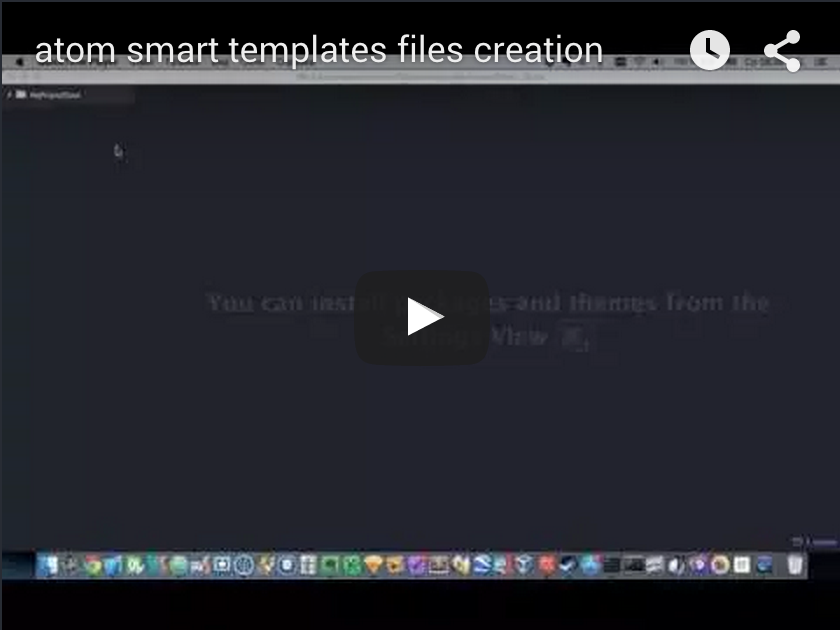

# atom-smart-template package

The package is designed for quick and easy creation of file or multiple files and directories from a template using parameters.

# How to use
To use use the command "Create files from template" from the context menu of the file tree.

